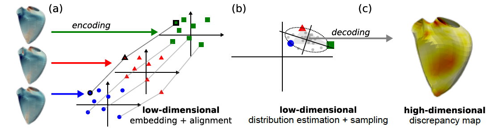

## Official repository for the paper:

### **Visualizing definitional divergence in high-dimensional data by manifold alignment: Application to 3D right ventricular strain computations**  
Maxime Di Folco,  Gabriel Bernardino, Patrick Clarysse, and Nicolas Duchateau 

*Accepted in IEEE Transactions On Medical Imaging*

## Abstract

Medical imaging studies often rely on a single sample per subject, assuming it is representative of their physiological traits. However, variations in how input descriptors are defined or computed (e.g. due to a lack of consensus in the scientific field) may have a crucial impact on the analysis, and are hardly considered in practice. In this paper, we propose an original strategy based on representation learning to estimate a parametric map reflecting the impact of such definitional differences on a given physiological descriptor, previously extracted from medical images. We consider the different definitions or computations of such physiological descriptors as different high-dimensional data, potentially of heterogeneous {types. We} specifically focus on myocardial deformation (strain), for which there is limited agreement on its definition. We first use manifold alignment to match the latent representations associated with the different definitions of this descriptor. Then, we formulate plausible distributions in the latent space to represent definitional divergence across descriptors, from which we reconstruct a high-dimensional parametric map to visualize such definitional divergence. 

Due to the lack of proper ground truth for this specific clinical application, we first demonstrate this methodology on toy experiments and then expand the evaluation on right ventricular strain data from subjects obtained from 3D echocardiographic image sequences, for which different types of strain are available at each point of the right ventricle endocardial surface mesh. Beyond this illustrative application, our methodology has the potential to be generalised to many other population analyses considering heterogeneous high-dimensional descriptors.

---

## Overview

This repository contains the code, experiments, and supplementary materials associated with the paper.

<p align="center">
  
</p>

<p align="center">
  <em>Figure 1: Overview of the pipeline proposed in this paper. </em>
</p>

---

### Repository Structure

```text
.
├── src/                                    # Source code
│   └── LearningTools                       # Manifold Learning Methods
│   │ COIL100_noisy_exp.m                   # Replicate toy experiments
│   │ generateSimpleGaussianDistrib.m       # Toy example  
│   │ getGaussianDistrib.m                  # Estimate Gaussian distribution 
│   │ divergenceNdesc.m                     # Compute divergence in the latent space
├── data/           # Toy Dataset to reproduce the experiments
├── assets/         # Figures and media
└── README.md